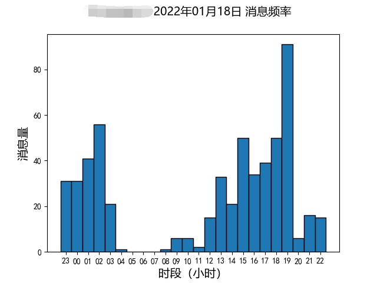

# 群聊词云

词云功能将会记录每天群内的聊天文字记录，并在每天预设时间（目前是23点整）将群聊热点和关键字以词云云图方式发送到群内，以及按时段分布的群聊频率（即每小时的消息条数）以条形图方式发送到群内。

以 [mgsky1/FG](https://github.com/mgsky1/FG) 为基础，面向nonebot2几乎全部重构。有很多人在群里问我是不是基于词库，统计词的数量，这里统一回答下，不是的，原理可参考 [该论文](https://github.com/mgsky1/FG/blob/mirai/assets/TextRank-algorithm.pdf) 。

[[toc]]

::: warning 注意
开启此项功能，mokabot将会将群聊文字聊天内容以**明文形式**记录在服务器上，介意者请勿开启。
:::

::: details 查看词云和群聊频率示例


:::

## 开启/关闭云图

提供一个开启和关闭云图的开关。

```
开启云图
关闭云图
```

## 立即显示云图

默认情况下将会在23点才显示本群云图和条形图，使用这个指令可以让mokabot把到目前为止的聊天记录立即生成云图并发送到群内。**该指令仅可被管理员、群主和维护者使用**。

```
立即显示云图
```

## 复习

<ClientOnly>
  <Messenger :messages="[
    { position: 'right', msg: '开启云图' },
    { position: 'left', msg: '已开启云图，群组 114514 的云图设置已设为1，将在每天23点准时发送该群云图，管理员可通过发送 立即显示云图 来提前查看云图' },
    { position: 'right', msg: '关闭云图' },
    { position: 'left', msg: '已关闭云图，群组 114514 的云图设置已设为0' },
  ]"></Messenger>
</ClientOnly>
