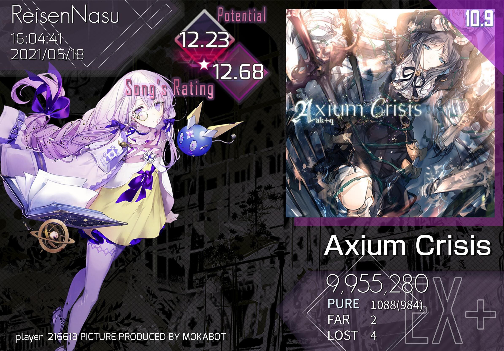

# Arcaea

[[toc]]

::: details 《对所有使用arc查分器用户的告知》（如果你什么都没有绑定可以先跳过）

由于616的众所周知的措施，原查分途径已失效，moka现采用`estertion`+`webapi`双重查分方案，两个方案之间完全独立运行。
如果你需要使用`estertion`查分方案，请使用`arc查询`指令，然后请耐心等待3~10分钟（实际时间取决于est那边排队时间，也有可能根本排不上）。
如果你需要使用webapi查分方案，请使用`arc最近`指令，理论上是几秒之内就能返回。

`webapi`查分基于其原理有两个必要条件： 

 - 你的账号在 [PArisa](../advanced/whats_webapi.html#PArisa) 的好友列表中（即PArisa已经加你为好友）。
 - mokabot能在PArisa返回的所有好友的成绩中识别出你的成绩（即mokabot认识你）。

基于上述必要条件，用户必须先使用`arc绑定`绑定好友码，然后使用`arc绑定用户名`来绑定用户名，然后请等待开发者通过你绑定的好友码添加你到PArisa的好友列表中。
2021年7月前已绑定过arc好友码的用户，我已经提前人工逐个添加你们为好友，故无需进行上述等待，但你们一样需要绑定用户名才能使用备用查分器。

与此同时，旧版本的`arc最近 <好友码>`、`arc查询 <歌曲名>`、`arc强制查询`在当前环境下均不可用，请仅使用下述的`arc查询`和`arc最近`指令。

::: warning 常见误区：

 - 绑定用户名后认为`arc查询`会变快（**并不会变快，而且两个方案是独立的**）。
 - 认为mokabot没有响应，频繁使用`arc查询`（**不是没响应，是在排队**）。
 - 绑了用户名却没绑好友码（**没好友码我没法加你为PArisa的好友**）
 - 绑了错误的好友码（**还是没法加你为好友**）
 - 绑定了错误的用户名（例如输入错误），**导致程序没法筛选出你的成绩**。

:::


## 查询全部Arcaea成绩（`arc查询`）

从 estertion 的 [查分器](https://redive.estertion.win/arcaea/probe/) 查询某一id的信息，信息格式与他的查分器基本一致。

此外，还将包含：

 - 使用 **估算的** recent top 10 平均值及其邻域取代原来的5位小数t10均值（因为从Lowiro服务器返回的潜力值的精度只有0.01，因此算出来的t10均值不可能是精确值，只能是一个区间）。
 - 天花板（b30列表中最好的成绩）与地板（b30列表中最差的成绩）的单曲rating将直接显示在b30列表的最前面。
 - 如果你的最近一次成绩刷新了你这个谱面的最高分，这个谱面在best列表中的位置将直接显示在recent信息中。
 - 在b30列表结束后，继续显示b31~b35。

```
arc查询 [好友码]
```

不带任何参数时，mokabot将从数据库中查看你的QQ是否已绑定到某一好友码，从而免去你手动输入的麻烦。

::: details 查看返回样例

:::

## 查询最近的Arcaea成绩（`arc最近`）

使用 [webapi](../advanced/whats_webapi.md) 查分方案查询你的最近一次成绩。该功能使用需要你**同时绑定好友码和用户名**，并且我已经将你的账号添加到PArisa的好友列表中。

::: tip 提示
什么是 [PArisa](../advanced/whats_webapi.html#PArisa) ？
:::

```
arc最近
```

::: details 查看返回样例

:::

## 绑定Arcaea用户名和好友码

如果你从不需要使用`arc最近`功能，那你没有必要绑定用户名，仅绑定好友码即可，否则请绑定好友码和用户名。

```
arc绑定 <你的好友码>
arc绑定用户名 <你的用户名>
```

绑定用户名时，视以下两种情况：

#### 你已经绑定过好友码，但未绑定用户名

此类用户请直接使用`arc绑定用户名 你的用户名`。

<ClientOnly>
  <Messenger :messages="[
    { position: 'right', msg: 'arc绑定用户名 FuLowiriCk' },
    { position: 'left', msg: '...（大概意思是绑定好了）' },
  ]"></Messenger>
</ClientOnly>

#### 你什么都没绑定

此类用户请先使用`arc绑定 你的好友码`，然后使用`arc绑定用户名 你的用户名`，即比上述用户多一个绑定好友码的流程。 

<ClientOnly>
  <Messenger :messages="[
    { position: 'right', msg: 'arc绑定 114514191' },
    { position: 'left', msg: '...（大概意思是好友码绑定好了）' }, 
    { position: 'right', msg: 'arc绑定用户名 FuLowiriCk' },
    { position: 'left', msg: '...（大概意思是用户名绑定好了）' }
  ,]"></Messenger>
</ClientOnly>

::: warning 请多看一眼吧

为了让你可以舒适友好地使用Arcaea成绩查询功能，请 ***不要只绑定用户名*** ，至于为什么请阅读该小节头部的《对所有使用arc查分器用户的告知》。

绑定完**用户名**后**请等待我人工**将你的账号添加到PArisa的好友列表中（快的话1分钟之内，慢的话1小时之内）。
:::

## 改变查分样式

未设置这一项之前，你使用`arc最近`时，mokabot返回的成绩图是一个随机样式。设置之后，将会变更为一个确定的样式。

目前有三个样式：`moe`、`guin`、`bandori`

::: details 查看样式示例
1、moe


2、guin


3、bandori


:::

```
arc查分样式 样式
```

## Arcaea各种表

以多种方式发送Arcaea的定数表，以及PM难度表和TC难度表。

### 推特定数表

发送 [@Arcaea_I_G](https://twitter.com/Arcaea_I_G) 制作的推特定数表，目前推特定数表已经可以自动更新。

```
const<8/9/10>
```

::: warning 注意
请不要输入类似与`const 9`这类中间带空格的，你应该直接输入`const9`（不带空格）。
:::

### 维基定数表

发送 [Arcaea中文维基定数表](https://wiki.arcaea.cn/index.php/%E5%AE%9A%E6%95%B0%E8%A1%A8) 。

```
定数表 [ftr/prs/pst/byd]
```

不加参数时默认按歌曲名升序，加参数则认为按照指定难度降序。

### 维基PM表

发送 [Arcaea中文维基PM难度表](https://wiki.arcaea.cn/index.php/PM%E9%9A%BE%E5%BA%A6%E8%A1%A8)  。

```
pm表
```

### 维基TC表

发送 [Arcaea中文维基TC难度表](https://wiki.arcaea.cn/index.php/TC%E9%9A%BE%E5%BA%A6%E8%A1%A8) ，TC指的是推分。

```
tc表
```

## Arcaea相关计算

### 定数、分数、评价相关计算

众所周知，已知Arcaea的`定数`、`分数`、`评价`中的其中任意两个，可以推算出第三个的值。命令请用`arc计算`作为开头，然后按照示范输入你的已知值。

::: warning 注意
所有数字使用浮点或整数均可，但分数必须以万作为单位
:::

```
arc计算  定数10      分数979
arc计算  分数999.95  定数10
arc计算  评价12.2    分数1000
```

### ptt、b30、r10相关计算

同上，已知Arcaea的`ptt`、`b30`、`r10`中的其中任意两个，可以推算出第三个的值。命令请用`arc计算`作为开头，然后按照示范输入你的已知值。

::: warning 注意
所有数字使用浮点或整数均可
:::

```
arc计算  ptt11.5   b11.45
arc计算  ptt11.31  r11.8
arc计算  b10.11    r11.5
```

## 复习

<ClientOnly>
  <Messenger :messages="[
    { position: 'right', msg: 'arc绑定 114514191' },
    { position: 'left', msg: '关联完成！已将QQ 12345678 关联至Arc好友码 114514191' }, 
    { position: 'right', msg: 'arc绑定用户名 FuLowiriCk' },
    { position: 'left', msg: '关联完成！已将QQ 12345678 关联至Arc用户名 FuLowiriCk ，请等待管理员为查询用账号添加好友，并且请注意账号名称的大小写\n若您在2021年7月之前已经绑定过好友码，那您无需等待管理员添加您到查分器好友列表中\n绑定用户名之后请尽量使用 arc最近 而不是 arc查询 ，否则依旧需要相当长的时间排队\n注意：变更用户名后需要重新绑定用户名' },
    { position: 'right', msg: 'arc查询' },
    { position: 'left', msg: '【12.80 ⭐⭐.jpg】' }, 
    { position: 'right', msg: 'arc最近' },
    { position: 'left', msg: '【Tempestissimo (BYD 11) 10001540 FPM.jpg】' }, 
    { position: 'right', msg: 'arc查分样式 guin' },
    { position: 'left', msg: 'QQ 12345678 的arcaea最近成绩图的样式已设置为 guin' }, 
    { position: 'right', msg: 'const10' },
    { position: 'left', msg: '【const10.jpg】' }, 
    { position: 'right', msg: '定数表' },
    { position: 'left', msg: '【维基定数表.jpg】' }, 
    { position: 'right', msg: '定数表 ftr' },
    { position: 'left', msg: '【按ftr降序的维基定数表.jpg】' }, 
    { position: 'right', msg: 'pm表' },
    { position: 'left', msg: '【维基PM表.jpg】' }, 
    { position: 'right', msg: 'tc表' },
    { position: 'left', msg: '【维基TC表.jpg】' }, 
  ]"></Messenger>
</ClientOnly>
