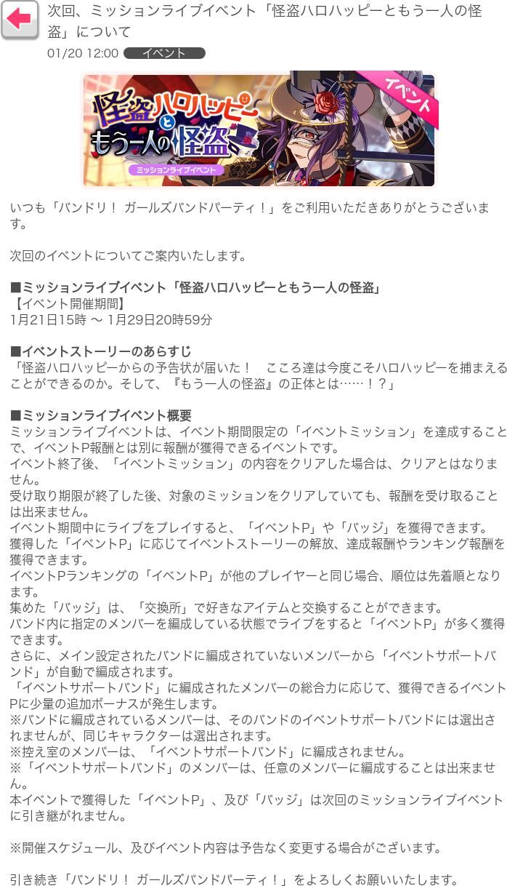

# Bandori

[[toc]]

## 有车吗

从 [Bandori车站](https://bandoristation.com/) 获取最新车牌。

::: warning
`ycm`、`车来`、`有车吗`都能触发该命令。为了避免和Tsugu冲突，这个命令只能由@机器人或私聊触发，请尽量使用Tsugu查询，仅在Tsugu无法正常使用的时候使用moka查询车牌
:::

```
@mokabot ycm
@mokabot 车来
```

## 邦邦谱面查询（已弃用）

::: danger Deprecated
由于上游不再更新，该功能已经弃用。如果我在以后开发出了自动解析邦邦谱面文件功能，可能会考虑重做该功能。

2022年1月15日更新：

好了我现在真的在做了
:::

请查看命令及其示范，并且搭配谱面列表使用。

```
查询谱面 <三位数ID><难度标记>[镜像]
查询谱面 <别名>
```

以上`<三位数ID><难度标记>[镜像]`称为`标准谱面id`

难度标记：`ez(easy)` `no(normal)` `hd(hard)` `ex(expert)` `sp(special)`，末尾可以加`M(mirror)`，总结如下表

|难度|难度标记|带镜像的难度标记|
|:---:|:---:|:---:|
|Easy|`ez`|`ezM`|
|Normal|`no`|`noM`|
|Hard|`hd`|`hdM`|
|Expert|`ex`|`exM`|
|Special|`sp`|`spM`|

例如你可以使用`查询谱面 243ex`来查询火鸟(full)ex谱面；使用`查询谱面 037exM`来查询贼船ex镜像谱面；或者使用`查询谱面 六兆年sp`来查询六兆年的sp谱面，前提是`六兆年sp`这一别名已经被映射到标准谱面id`128sp`

## 邦邦谱面映射（已弃用）

将谱面别名映射到标准谱面id，标准谱面id和谱面查询所用的格式相同，你需要搭配谱面列表使用。

```
谱面映射 <谱面别名> <标准谱面id>
```

## 邦邦谱面列表（已弃用）

将目前所有已经收录的谱面生成列表，可以按照ex难度降序或者歌曲标号升序。

```
谱面列表    # 默认，按照歌曲标号升序
谱面列表ex  # 按照ex难度降序
```

## HSR表

查看阿怪制作的hsr表（日服）。

::: tip 更新时间
2021-08-12
:::

```
hsr表
```

## 设置公告

开启此功能后，mokabot将会定时获取国服/日服公告，并发送至群内。mokabot将使用合并——转发方式发送公告，以避免刷屏

```
<开启/关闭><国服/日服>公告
```

::: details 查看公告样例（日服）

日服新公告

标题：EVENT 次回、ミッションライブイベント「怪盗ハロハッピーともう一人の怪盗」について

时间：2022-01-20 11:00:00 (UTC+8)



:::

## 邦邦活动列表

从 [bestdori](https://bestdori.com/) 生成一个包含活动id、活动类型、活动时间与活动名称的列表。

```
活动列表 <服务器代号>
```

|服务器|日服|国服|国际服|台服|韩服|
|:---:|:---:|:---:|:---:|:---:|:---:|
|服务器代号|`JP`|`CN`|`EN`|`TW`|`KR`|

## 邦邦榜线追踪

从 [bestdori.com](https://bestdori.com/) 查询最新榜线，同时计算预测档线可以查询bestodri上已存在的除了T10以外的档线。建议搭配活动列表使用。当活动id为`0`的时候，认为你查询的是最新一期的档线和预测。

::: warning
mokabot使用的是自己的而不是bestdori的预测数学模型，档线的预测结果仅供参考，mokabot对此不负任何损失带来的责任。

如果你对mokabot所使用的算法感兴趣，你可以参考 [这里](../advanced/prediction.md)
:::

```
分数线 <活动id><服务器代号><档线>
```

其中，

 - `活动id`是一个数字（没有固定位数，无需在前面补0），可以使用`活动列表`指令查到，这也是我说建议搭配活动列表使用的原因。或者你可以令`活动id`为`0`，这样mokabot会认为你查询的是该服务器的最新一期活动。

 - `服务器代号`也是见 [活动列表](#邦邦活动列表) 指令。

 - `档线`可以是bestodri上已存在的除了T10以外的档线，例如`100`、`1000`、`2000`等等

## 复习

<ClientOnly>
  <Messenger :messages="[
    { position: 'right', msg: '@mokabot ycm' },
    { position: 'left', msg: 'myc' },
    { position: 'right', msg: '查询谱面 243ex' },
    { position: 'left', msg: '【烤全鸡.jpg】' },
    { position: 'right', msg: '谱面映射 六兆年sp 128sp' },
    { position: 'left', msg: '映射已添加：六兆年sp → 128sp' },
    { position: 'right', msg: '查询谱面 六兆年sp' },
    { position: 'left', msg: '【六兆年sp.jpg】' },
    { position: 'right', msg: 'hsr表' },
    { position: 'left', msg: '【hsr表.jpg】' },
    { position: 'right', msg: '开启日服公告' },
    { position: 'left', msg: '已开启日服公告，群组 12345678 的设置news_jp已设为1' },
    { position: 'right', msg: '谱面列表' },
    { position: 'left', msg: '【谱面列表.jpg】' },
    { position: 'right', msg: '活动列表 JP' },
    { position: 'left', msg: '【日服活动列表.jpg】' },
    { position: 'right', msg: '分数线 104JP1000' },
    { position: 'left', msg: '【日服104期T1000档线.jpg】\n【日服104期T1000预测线.jpg】' },
  ]"></Messenger>
</ClientOnly>
