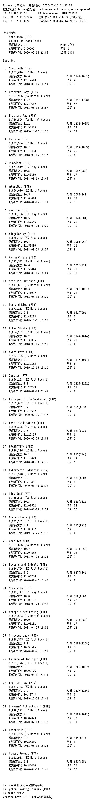
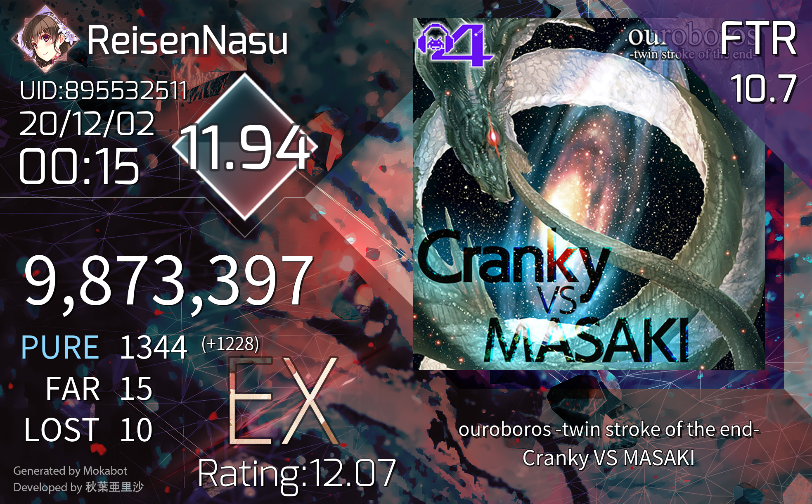
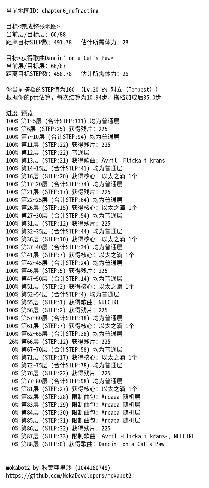

## mokabot 雏形（2020/2）

受 Estertion 的 [查分站](https://redive.estertion.win/arcaea/probe/) 启发，我做了一个爬取查分站的 bot，具体原理是直接与查分站的后端进行 WebSocket 通信。代码参考了 Estertion 的 [后端代码](https://gist.github.com/esterTion/fe184d4e51c2421310bdeba26046f139) 制成。

最初的查询结果极其简陋，因为我不会做图查，所以模仿查分站做了个文字版的：

（有趣的是，这个风格一直持续到了 AUA 终止服务）

他拥有查分站的部分功能，包括：

 - 用户数据（UID、潜力值、注册时间等）
 - 最近成绩
 - Best 30（格式与查分站一致）

并且此时已经拥有了 `arc绑定` 功能。

## mokabot 早期（2020/3 ~ 2021/6）

mokabot 早期即 mokabot 一代，因为种种原因（水平太菜，代码难看）并没有上传至公开的 GitHub 仓库。

#### 2020-04-17

1. 加入推特定数表和 PM 难度参考表
2. 加入 Arcaea 中文维基定数表

#### 2020-04-22

1. `arc查询` 可查询所使用角色
2. `arc查询` 可计算每 far 所对应的分数
3. `arc查询` 的最近成绩可以计算和 Best 30 列表中相同曲目的差距，并折算为 far 数量

#### 2020-07-14

1. 加入 `arcaea_lib.py` 通过模拟客户端，实现完全自主的成绩查询（即添加好友——挨个查单曲方式）
2. 添加 `arc强制查询` 功能，在用户隐藏潜力值时仍然可以查询 Best 30 列表

实际上是基于 [`libarc`](https://github.com/jywhy6/libarc/blob/master/libarc.py) 并加以修改实现的。

#### 2020-10-28

`arc查询` 添加查询所谓 `不推分即可达到的ptt上限` 的功能（即：将 Best 前 10 视为 Recent Top 10 之后计算的定数，这一名称后来变更为：`以Best前10作为Top10时的潜力值`）。

#### 2020-12-03

加入 `单曲查询` 功能，样式：

#### 2020-12-29

为 `单曲查询` 功能添加 `bandori` 模式：

#### 2021-01-04

开始引入 `BotArcAPI` 中的 `arcsong.db`，并使用其中的歌曲别名表和定数表。

#### 2021-01-23

加入 `arc获取体力` 功能（即请求 `/purchase/me/stamina/fragment` 终结点）。

#### 2021-03-18

加入 `arc导航` 功能：

#### 2021-05-16

臭名昭著的 Arcaea 3.6.0 到来，导致游戏查分从此出现了翻天覆地的变换。

Lowiro 向请求头中加入了一个 `X-Random-Challenge` 字段，而基于我当时的技术力根本没法去逆向 `libcocos2dcpp.so` 来得知该字段的生成算法。

于是我根据湖精姐写的 [archash4all](https://www.npmjs.com/package/archash4all) 重写后稍加修改，并编译成 `dll` 和 `so` 文件，让 Python 程序通过 `ctypes` 调用该 C 动态链接库，从而计算出 `X-Random-Challenge` 字段。

可是这个方法没用几天，Lowiro 发布了更加臭名昭著的 3.6.4 版本，并更新了 `X-Random-Challenge` 字段的生成算法。

## mokabot 过渡期（2021/6 ~ 2021/9）

mokabot 过渡期即 mokabot2，从这个版本开始，所有的源码都将写在公开的 GitHub 仓库上。

#### 2021-06-20

新的算法已经由其他查分器开发者开发出来，但是并没有公开于 GitHub。经 [FengYuu](https://github.com/FengYuu) 在群内指导，开发了一种全新的查询方式，即 [`webapi` 查询](https://github.com/MokaDevelopers/mokabot2/blob/master/docs/advanced/whats_webapi.md)。

## mokabot 现代（2021/9 至今）

现代版本已经将 mokabot 从我的个人 GitHub 账号转移至 [MokaDevelopers](https://github.com/MokaDevelopers) 组织下。

#### 2021-09-18

加入 Arcaea 中文维基的 TC 难度表和 PM 难度表。

#### 2021-12-28

将 Best 30 显示更改为 Best 35，方便玩家检视地板以下若干歌曲。

#### 2022-03-10

有幸加入 [Arcaea-Infinity](https://github.com/Arcaea-Infinity) 组织，并由此正式接触到了 BotArcAPI、ArcaeaLimitedAPI 和 ArcaeaUnlimitedAPI。

#### 2022-03-14

正式使用 ArcaeaUnlimitedAPI 完整取代原有的 webapi 查分方案，得以从持续了 9 个月的手动上号添加好友的重复劳动中解脱出来。

#### 2022-04-01

1. 由于 ArcaeaUnlimitedAPI 可以正确计算 `X-Random-Challenge` 字段，因此恢复了 `arc获取体力`、`arc导航` 的全部功能
2. 添加了自动更新 Arcaea 素材文件的 bash 脚本

#### 2022-04-08

引入 Andreal 的三种最近/最佳查分样式及其 Best 30 查分样式（由 [林文轩](https://github.com/Linwenxuan05) 从 Andreal 移植）。

#### 2022-07-28

设计了 [ArcaeaChartRender](https://github.com/Arcaea-Infinity/ArcaeaChartRender) 并以此实现 `arc谱面` 功能。

#### 2023-02-19

设计了 [auapy](https://github.com/zhanbao2000/auapy)，将 ArcaeaUnlimitedAPI 封装成 Python 库。
